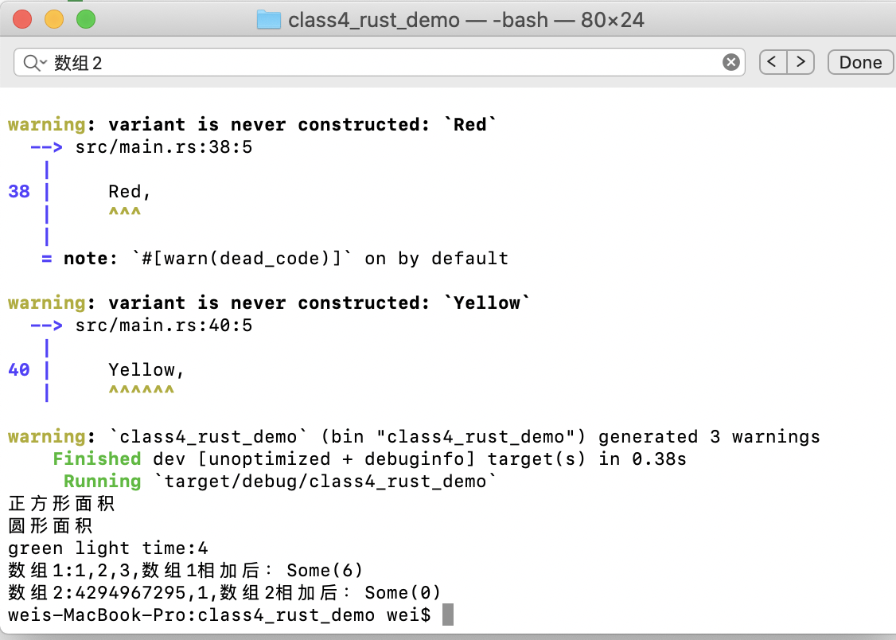

# class4_rust_demo
class4 homework


## 为枚举交通信号灯实现一个 trait，trait里包含一个返回时间的方法，不同的灯持续的时间不同

```
enum TrafficLight {
    Red,
    Green,
    Yellow,
}

pub trait TrafficTime {
    fn time(&self) -> u32;
}

impl TrafficTime for TrafficLight {
    fn time(&self) -> u32{
        match self {
            TrafficLight::Red => 3,
            TrafficLight::Green => 4,
            TrafficLight::Yellow => 5,
        }
    }
}

```

## 实现一个函数，为u32类型的整数集合求和，参数类型为 &[u32]，返回类型为Option，溢出时返回None
```
fn sum(nums:&[u32]) -> Option<u32>{
    let mut sum:u32 = 0;
    for elem in nums {
        if (sum + elem) < u32::MAX {
            sum += elem;
        } else {
            return  None;
        }
    }
    Some(sum)
}
```

## 实现一个打印图形面积的函数，它接收一个可以计算面积的类型作为参数，比如圆形，三角形，正方形，需要用到泛型和泛型约束
```
pub trait Shape {
    fn area(&self);
}

struct Circle{}

struct Triangle{}

struct Square{}

impl Shape for Circle {
    fn area(&self) {
        println!("圆形面积");
    }
}

impl Shape for Triangle {
    fn area(&self) {
        println!("三角形面积");
    }
}

impl Shape for Square {
    fn area(&self) {
        println!("正方形面积");
    }
}


fn area<T:Shape>(shape: &T){
    shape.area();
}
```

## 运行结果截图
